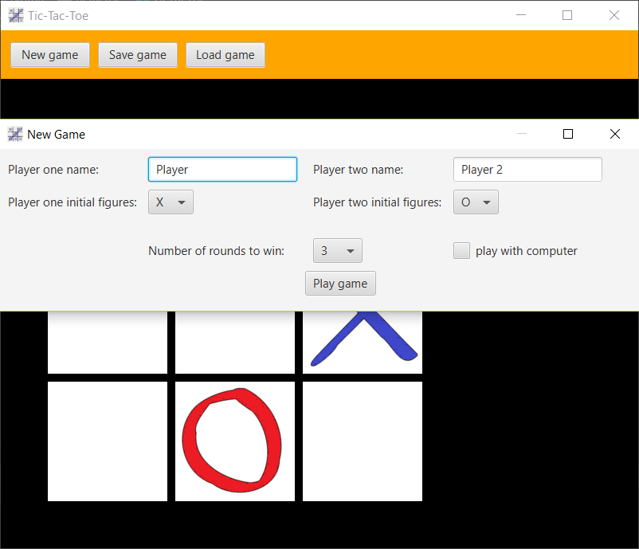

# TIC-TAC-TOE GAME

## 1. DESCRIPTION

Simple application that allows to play in Tic-tac-toe game with 
both the computer and the second player.

## 2. TECHNOLOGIES

- JavaFX

## 3. DEMO

## 4. HOW TO BUILD

Follow these simple steps to create a play this game:

1. Clone this project
1. Build: `gradlew.bat build`
1. Run: `java -jar build/libs/tic-tac-toe-1.0-SNAPSHOT.jar`

## 5. FUTURE PLANS

- Improvement of computer move generator algorithm
- Allow computer vs computer games
- Addition of unit tests
